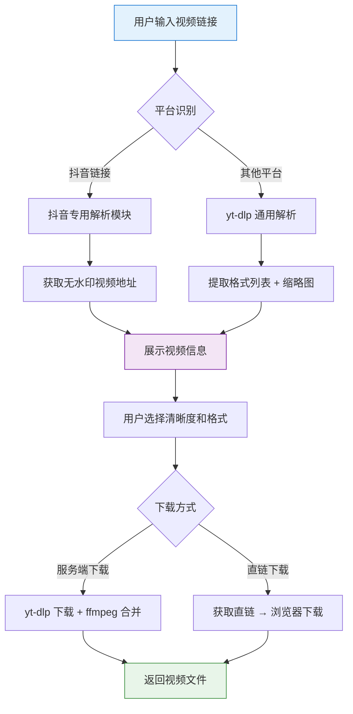
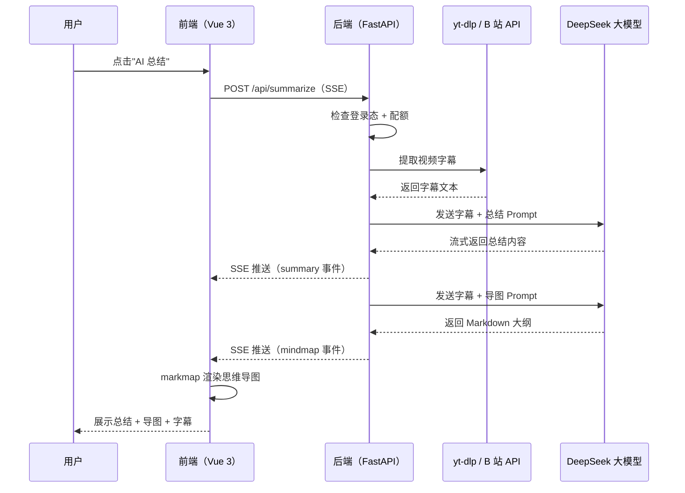

# Cursor - AI Universal Video Downloader & Summarizer Project Practice

This is a project tutorial centered on hands-on AI programming. Based on Vue 3 + FastAPI + yt-dlp + DeepSeek + Stripe, it uses AI coding to build an **AI Universal Video Downloader & Summarizer** from 0 to 1, letting you experience the full Vibe Coding workflow firsthand and learn how to quickly create a practical tool that can actually be launched and monetized!

Project code is open source for free: https://github.com/liyupi/free-video-downloader

Complete video tutorial + written tutorial (estimated 3 to 7 days to finish): https://www.codefather.cn/course/2027618983506640897

## Project Overview

A lot of people want to download and save videos locally—for example, to watch technical tutorials offline or back up work they uploaded themselves. But many platforms either don’t support direct downloading, limit the quality, or require installing all kinds of clients, which is very inconvenient.

Going one step further, if you could quickly understand the core content of a long video before downloading it—for example, seeing an AI-generated outline and key points before watching a 2-hour technical talk—you could judge whether it’s worth your time and greatly improve your learning efficiency.

More importantly, this project isn’t just about building a tool. It’s about teaching everyone a **way to quickly solve problems with open-source projects**. You don’t need to reinvent the wheel. Stand on the shoulders of giants, use AI coding to quickly wrap and extend existing projects, and you can rapidly build a stronger SaaS platform.

That’s the starting point of the AI Universal Video Downloader & Summarizer: enter a video link, and the tool automatically parses video information, supports downloading videos from **1800+** platforms including Bilibili, YouTube, and Douyin, while also providing **AI video summaries** (summary + mind map + Q&A). It also integrates **user authentication** and **Stripe international payments**, making it a real product that can be launched and monetized.

**One link handles video download + AI summary, doubling your learning efficiency!**

## Feature Demo

1) Multi-platform video parsing and download

Enter a video link from a mainstream video platform, and the system automatically parses the title, cover image, and duration, then provides multiple quality and format options for download. Based on the open-source project `yt-dlp`, it supports **1800+** websites, including major platforms like Bilibili, YouTube, and Douyin. For platforms like Douyin that need special handling, a dedicated parsing module was developed, allowing watermark-free video retrieval without requiring users to provide Cookies.

2) AI video summary

After parsing the video, the system automatically extracts subtitles and calls the DeepSeek large model for content analysis, streaming out a summarized overview of the video in beautifully formatted Markdown to help users quickly understand the key points.

3) AI-generated mind map

It automatically generates an interactive mind map based on the video content, helping users understand the structure of the video at a glance. It supports full-screen display, zooming and dragging to view the full content, and exporting high-definition PNG and SVG images.

4) AI video Q&A

Users can freely ask questions based on the video content, and AI will provide targeted answers based on the subtitle text to support deeper learning.

5) Subtitle export

It supports downloading subtitle files in formats such as SRT, VTT, and TXT, making it easy for users to organize and study them on their own.

6) User signup/login + membership permissions

It supports email + password signup/login and uses JWT for stateless authentication. Free users can use AI summarization 3 times per day, while VIP members have unlimited access.

7) Stripe international payments

It integrates the Stripe international payment platform, supporting multiple payment methods such as credit cards. Users can activate VIP membership with one click to unlock unlimited AI summarization.

## What You’ll Gain from This Project

This project has a fresh topic that keeps up with the AI coding era and is oriented toward **practical tools + commercial monetization**, unlike the usual overdone CRUD projects. You’re not just writing code—you’re using AI to build a truly valuable tool that can also make money once launched.

The project content is focused and **can be finished in less than a week**, allowing you to quickly master the core AI coding workflow: requirement analysis → solution design → coding development → testing and verification → feature expansion → SEO/GEO optimization → payment integration, so you can truly experience the full closed loop of AI programming from development to monetization.

From this project, you can learn:

- How to use AI coding to build a complete frontend-backend project from 0 to 1
- How to install and use MCP and Agent Skills to enhance AI capabilities
- How to use open-source projects to implement multi-platform video downloads, and how to adapt them for specific platforms
- How to use the DeepSeek large model to implement AI video summaries, mind maps, and Q&A
- How to use SSE for streaming data transfer
- How to implement user authentication and permission control based on JWT
- How to integrate Stripe international payments, including payment collection and Webhook callbacks
- How to do SEO and GEO optimization so more people can discover your product
- How to use Cursor SubAgents to develop multiple features in parallel

## Feature Breakdown

This project is feature-rich, covering 5 major modules—video parsing and downloading, AI-powered summarization, user authentication, membership payments, and SEO/GEO optimization—with 20+ feature points, covering the complete product loop from tool development and AI applications to commercial monetization.

## AI Coding Development Workflow

This project follows the most mainstream AI coding project workflow:

First, write a requirement description prompt for AI and ask it to help with competitive analysis and solution design. I also installed Firecrawl MCP to fetch webpage content for competitive research, and Context7 MCP to automatically pull the latest technical documentation so the code AI writes doesn’t go out of date.

Second, manually confirm the solution. The frontend uses Vue 3 + Tailwind CSS, the backend uses Python FastAPI, and the core of video downloading is the 140k-star open-source project `yt-dlp`. Once that looked good, I let AI start writing code.

Third, start development. AI first plans a task list, then completes frontend and backend development step by step. After coding, it even opens the browser and tests the site by itself.

Fourth, test and verify. I manually review the result, then feed issues back to AI for fixes if necessary.

Once the core business workflow is running, it’s time to keep iterating and optimizing. For example, Douyin video downloads required Cookies, but asking users to get them manually was too troublesome, so AI found a no-Cookie Douyin parsing solution on its own and directly integrated it. There was also a problem where Markdown rendered incorrectly on the frontend during SSE streaming, and only after prompting AI to inspect the backend’s return-data encoding did it locate the root cause.

When building later expansion features, I also used SubAgents, letting AI develop three features in parallel at the same time: Markdown rendering optimization, full-screen mind map display, and subtitle downloads. That basically doubled efficiency. After each stage, I committed the code with Git, and when opening a new AI chat window later, I just handed the docs to AI so it could quickly recover context and continue.

I recommend committing code with Git after every feature to prevent AI from accidentally breaking the project later. If the context gets too long and AI starts losing track, open a new chat window and give AI the requirements and solution documents so it can reanalyze the existing code and recover context.

## Core Business Workflow

The overall video download flow is: user enters a link → platform routing (Douyin / generic) → parse video info → user chooses format and quality → server downloads → return file.

The core AI summarization flow is: extract subtitles → call DeepSeek to stream-generate the summary → generate a mind map → support interactive Q&A.

## Tech Stack

This project is centered on a Python backend + Vue frontend with separated frontend and backend, covering practical technologies such as multi-platform video downloads, AI large-model content summarization, SSE streaming, JWT authentication, Stripe international payments, and SEO/GEO search optimization. With just one project, you can master the core tech stack for taking a utility product from development to monetization.

Backend: FastAPI (Python async web framework), `yt-dlp` (video downloading engine supporting 1800+ sites), dedicated Douyin parsing module (no-Cookie solution), DeepSeek API (AI video summaries and Q&A), SQLite, JWT (`PyJWT`), `bcrypt`, Stripe, `httpx`, SSE (Server-Sent Events)

Frontend: Vue 3 (`script setup`), Vite 7, Tailwind CSS 4, Axios, Marked, `markmap-lib` + `markmap-view` (interactive mind maps), `@tailwindcss/typography`

AI coding tools: Cursor (including Browser Use browser automation), MCP extensions (Firecrawl web scraping + Context7 latest technical docs), Agent Skills (SEO optimization), SubAgents for parallel feature development

## Architecture Design

This project uses a separated frontend-backend architecture. The frontend uses Vue 3 + Vite, the backend uses FastAPI + SQLite, and they communicate through REST APIs and SSE. The backend integrates `yt-dlp` to support multi-platform video downloads, uses the DeepSeek API for AI summaries, and Stripe for payments. Overall, the architecture is lightweight and efficient.

Complete video tutorial + written tutorial (estimated 3 to 7 days to finish): https://www.codefather.cn/course/2027618983506640897

## Recommended Resources

1) Yupi AI Navigation Website: [Comprehensive AI Resources, Latest AI News, Free AI Tutorials](https://ai.codefather.cn)

2) Programming Navigation Learning Circle: [Learning Paths, Programming Tutorials, Practical Projects, Job Hunting Guide, Q&A](https://www.codefather.cn)

3) Programmer Interview Cheatsheet: [High-Frequency Topics for Internships / Campus Hiring / Experienced Hiring, Plus Real Interview Question Analysis](https://www.mianshiya.com)

4) Programmer Resume Writing Tool: [Professional Templates, Rich Example Sentences, Direct to Interview](https://www.laoyujianli.com)

5) 1-on-1 Mock Interview: [A Must-Have for Internship / Campus Hiring / Experienced Hiring Interviews to Land Offers](https://ai.mianshiya.com)
