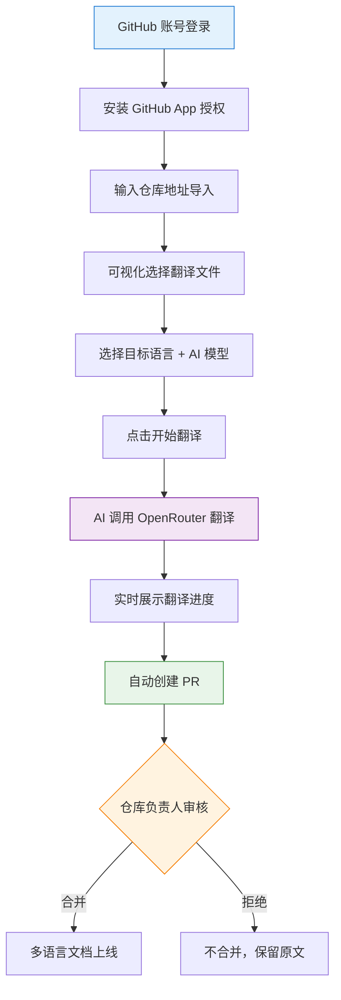

# Cursor - GitHub Document Translation Tool Project Practice

This is a project tutorial centered on hands-on AI programming. Based on Next.js + GitHub App + OpenRouter, it uses AI coding to build a **GitHub repository AI document translation SaaS platform** from 0 to 1, letting you experience the full Vibe Coding workflow firsthand and learn how to build a product that’s truly usable, deployable, and monetizable with AI!

Project code is open source for free: https://github.com/liyupi/github-global

Complete video tutorial + written tutorial (estimated 3 to 5 days to finish): https://www.codefather.cn/course/2014303010343092226

Project introduction video: https://bilibili.com/video/BV1mAAmzqEfP

## Project Overview

Yupi open-sourced an AI programming tutorial repository, [ai-guide](https://github.com/liyupi/ai-guide), which contains hundreds of Chinese tutorial documents. To let overseas users read them too, he wanted to translate the repository into multiple languages. But manual translation costs too much, and configuring GitHub Actions yourself is a hassle...

So instead, **why not build a more general-purpose tool**?

That’s the starting point of the GitHub Global project: enter any GitHub repository URL, and AI automatically translates its documents into multiple languages. When the source-language content changes, it automatically performs incremental translation sync, generates a PR, and waits for the repository owner to merge it—all without manual intervention.

No manual translation, no environment setup, no wrestling with GitHub Actions workflows. Just operate directly on the platform and easily help your open-source project go global.

**Zero configuration, one-click translation—take your GitHub project to the world!**

## Feature Demo

1) One-click sign-in with a GitHub account

Built on GitHub App for secure login and authorization. Compared with traditional OAuth Apps, permissions are more fine-grained, and tokens automatically expire after 1 hour, making it safer.

2) Import a GitHub repository

Enter a GitHub repository URL and click Import. The platform automatically fetches your repository information, making later translation configuration more convenient.

3) Configure translation and flexibly choose the translation scope

You can freely choose which languages to translate into (supporting 20 mainstream languages including English and French), and you can also use a visual file tree to select which documents should be translated.

4) Run translation with one click and automatically submit a PR

Click Translate, and AI calls an OpenRouter large model to execute the translation task, while the frontend shows real-time progress status:

After translation finishes, it automatically creates a GitHub pull request. The repository owner can choose whether to merge it, making the workflow both convenient and safe:

5) Automatically trigger incremental translation

After turning on the **Auto Translate** switch, whenever new document changes are pushed to the repository, the GitHub Webhook automatically notifies the platform. The system translates only files that are **both within the translation scope and have changed**, saving time and money:

6) Customize the large model and API Key

The platform provides a free AI translation quota by default. You can also configure your own OpenRouter API Key on the settings page and freely choose a translation model from the top 20 mainstream models on the leaderboard (supporting GPT, Claude, Gemini, DeepSeek, and more):

## What You’ll Gain from This Project

This project has a fresh topic that keeps up with the AI coding era. It’s oriented toward real SaaS product development, unlike the usual overdone CRUD projects. You’re not just writing code—you’re using AI to build a product with real value.

The project uses Vibe Coding as its core. More than 99% of the code was written by AI. The main tool used was Cursor, along with the `firecrawl-mcp` extension for web search and `context7` for the latest technical docs. The frontend also used the `ui-ux-pro-max` Agent Skill to generate a more polished UI.

The entire project took less than one day in total to build and deploy so everyone could access it!

From this project, you can learn:

- How to use AI for requirement research and generate a professional *Requirements Specification Document*
- How to use multiple AIs in parallel to develop the frontend and backend at the same time
- How to integrate with GitHub App for secure OAuth authorization and repository operations
- How to connect to OpenRouter through one unified interface for hundreds of AI large models
- How to use the GitHub API to get the repository file tree, commit files, and create PRs
- How to use GitHub Webhooks for event-driven automatic translation
- How to use an intranet tunneling tool to debug Webhook callbacks locally
- How to deploy a Next.js full-stack project with Vercel and launch quickly
- How to do code review, version control, and bug fixing in an AI development workflow
- How to identify competitive differentiation opportunities and design a product with real competitive strength

## Feature Breakdown

This project is feature-rich, covering 5 major modules—user authentication, repository management, translation configuration, translation execution, and change synchronization—with 20+ feature points, covering the core business scenarios of a real SaaS product.

## AI Coding Development Workflow

This project follows the most mainstream AI application development process:

First, write a prompt for requirement research and ask AI to search the web for competitors, analyze differentiation opportunities, and finally generate a requirements specification document.

Second, let AI design the technical solution: Next.js full-stack with TypeScript, MySQL + Prisma for the database, and OpenRouter for AI integration.

The third step is the key one: open two AI windows, one for the backend and one for the frontend. The backend produces API documentation first for the frontend to use, and both sides develop in parallel. After coding is done, open another window specifically for testing acceptance and bug fixing.

Once the core business workflow runs successfully, start building various extended features. I recommend committing code with Git after each stage to prevent AI from breaking the project later with random edits. To avoid AI losing track and wasting Tokens due to too much context, open new AI chat windows as needed when building extended features. Give AI the requirements doc and solution doc, then have it analyze the existing source code, and it can quickly regain context and continue working.

Finally, deploy to Vercel with one click. The whole project took less than one day in total to build and launch!

## Core Business Workflow

The user flow is very simple: sign in with a GitHub account → import a repository → configure translation scope and target languages → translate with one click → review and merge the PR. It only takes a few minutes.

## Tech Stack

This project uses Next.js full-stack + TypeScript as its core, combining frontend and backend in one codebase and making comprehensive use of a range of mainstream SaaS development technologies.

Frontend and backend: Next.js 15 (App Router), TypeScript, shadcn/ui + Tailwind CSS, Prisma ORM, MySQL, NextAuth.js

AI-related: OpenRouter API for unified access to 100+ large models, AI-powered smart translation, AI analysis of README structure

GitHub integration: GitHub App fine-grained permission control, GitHub REST API, GitHub Webhook, Octokit

Tools and deployment: Ngrok for intranet tunneling, Vercel one-click deployment, Docker containerization, Git version control

AI coding tools: Cursor, MCP extensions (`firecrawl-mcp` + `context7`), Agent Skills (`ui-ux-pro-max`)

## Architecture Design

This project uses an integrated Next.js full-stack architecture. The frontend and backend are merged into one codebase, server-side APIs are provided through API Routes, time-consuming translation tasks are handled with a local task queue, and the core business connects to both the GitHub API and OpenRouter.

Complete video tutorial + written tutorial (estimated 3 to 5 days to finish): https://www.codefather.cn/course/2014303010343092226

## Recommended Resources

1) Yupi AI Navigation Website: [Comprehensive AI Resources, Latest AI News, Free AI Tutorials](https://ai.codefather.cn)

2) Programming Navigation Learning Circle: [Learning Paths, Programming Tutorials, Practical Projects, Job Hunting Guide, Q&A](https://www.codefather.cn)

3) Programmer Interview Cheatsheet: [High-Frequency Topics for Internships / Campus Hiring / Experienced Hiring, Plus Real Interview Question Analysis](https://www.mianshiya.com)

4) Programmer Resume Writing Tool: [Professional Templates, Rich Example Sentences, Direct to Interview](https://www.laoyujianli.com)

5) 1-on-1 Mock Interview: [A Must-Have for Internship / Campus Hiring / Experienced Hiring Interviews to Land Offers](https://ai.mianshiya.com)
