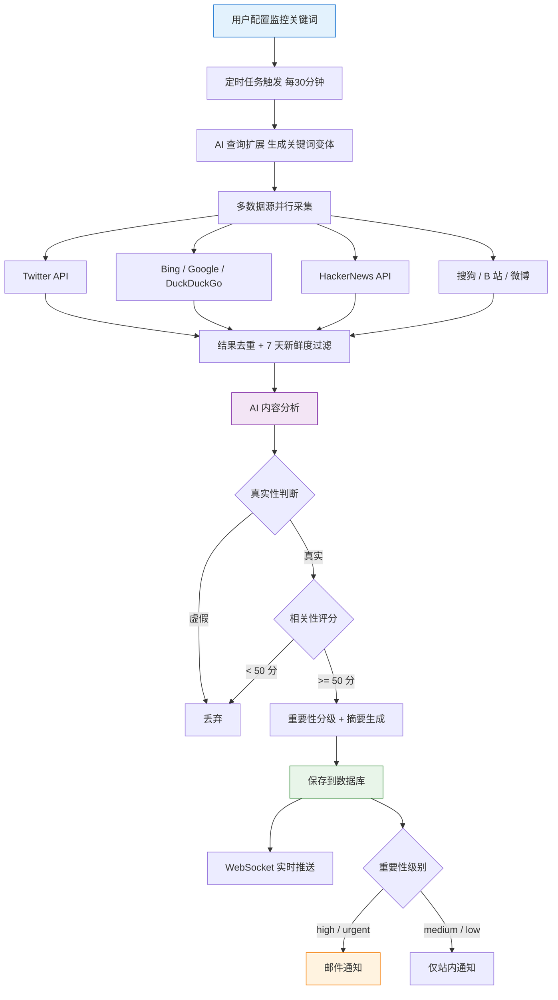

# GitHub Copilot - AI Hot Topic Monitoring Tool Project Practice

This is a project tutorial centered on hands-on AI programming. Based on Express 5 + React 19 + OpenRouter + Socket.io, it uses AI coding to build an **AI Hot Topic Monitoring Tool** from 0 to 1, letting you experience the full Vibe Coding workflow firsthand and learn how to quickly build a practical efficiency tool with AI!

Project code is open source for free: https://github.com/liyupi/yupi-hot-monitor

Complete video tutorial + written tutorial (estimated 2 to 5 days to finish): https://www.codefather.cn/course/2026625439052627970

## Project Overview

As an AI coding blogger, Yupi needs to know right away whenever there are updates to large models or shifts in the industry. But manually refreshing information sources is exhausting, and important content is often missed.

With this project, all you need to do is enter the keywords you want to monitor (such as `Claude` or `Vibe Coding`) and click **Scan Now**. The system then automatically fetches related content for you from more than 8 domestic and international information sources, such as Bilibili and Bing.

After fetching the content, AI automatically judges whether the information is real, analyzes its relevance to the keyword, evaluates its importance, and generates a Chinese summary. Low-quality content is filtered out directly, leaving only genuinely valuable hot topics.

When a new hot topic is found, it’s pushed to the page in real time through WebSocket, and especially important topics can also trigger email notifications. If there are too many topics, that’s fine too—you can quickly locate what you need through filtering and sorting.

Even cooler, the whole hot-topic monitoring capability is also packaged as an Agent Skills bundle. After installation, it can be used directly in various AI coding tools such as Cursor and Claude Code. With just one sentence, it can search the whole web, analyze content, and generate a hot-topic report for you.

**Let AI watch trending topics for you and get high-quality information the moment it appears!**

## Feature Demo

1) Configure monitoring keywords

Users enter the keywords they want to monitor, such as `Vibe Coding` or `Claude`, and the system automatically starts monitoring. It supports activating or pausing individual keywords.

2) AI automatically fetches and analyzes hot topics

Every 30 minutes, the system automatically fetches content from 8+ sources including Twitter, Bing, HackerNews, Sogou, Bilibili, and Weibo. It uses AI for query expansion, truth detection, relevance analysis, and intelligent summarization, then displays the filtered high-quality content in the feed.

3) Multi-dimensional filtering and sorting

It supports filtering by source, importance, and time range, as well as sorting by overall popularity, relevance, and publish time, helping users quickly find the hot-topic information they need.

4) Web-wide search

Besides the real-time hot-topic feed for monitored keywords, you can also directly search for a specific keyword and get information from across the web:

5) Real-time notifications

Hot-topic notifications are pushed in real time through WebSocket, and high-importance topics are also sent through email:

6) Agent Skills bundle

The hot-topic monitoring capability is packaged as a standard Agent Skill, so after installation it can be used in AI coding tools such as Cursor, VSCode Copilot, and Claude Code:

## What You’ll Gain from This Project

This project has a fresh topic that keeps up with the AI coding era and focuses on building a practical tool, unlike the usual overdone CRUD projects. You’re not writing code—you’re using AI to build a tool with real value.

The project is centered on Vibe Coding. More than 99% of the code was written by AI. The main AI coding setup used VSCode + GitHub Copilot, along with Firecrawl MCP for web scraping, Context7 MCP for the latest technical docs, and the UI UX Pro Max Agent Skill to polish the frontend. Combined with the Aceternity UI component library, it produced a cool, futuristic interface.

From this project, you can learn:

- How to use AI coding to build a complete tool from 0 to 1
- How to install and use MCP to enhance AI capabilities
- How to install and use Agent Skills to improve AI coding quality
- How to aggregate and fetch content from multiple sources (Twitter, Bing, HN, Bilibili, etc.)
- How to connect AI large models through OpenRouter to enable intelligent content review
- How to implement query expansion to improve recall in information retrieval
- How to use Socket.io to implement WebSocket real-time push
- How to use Aceternity UI to build a cool, futuristic frontend interface
- How to develop a standardized Agent Skills bundle and verify it across multiple AI tools
- How to do manual confirmation, version control, and iterative optimization in AI coding

## Feature Breakdown

This project is feature-rich, covering six major modules—keyword management, hot-topic collection and analysis, information display and filtering, real-time notification system, full-web information source search, and Agent Skills—with 20+ feature points, forming a complete hot-topic monitoring loop from information collection and AI analysis all the way to real-time push notifications.

## AI Coding Development Workflow

This project follows the most mainstream AI coding project development workflow:

First, write a requirement description prompt for AI and ask it to help design the solution. Of course, if you have your own ideas, you can add a bit of professional direction—for example, specifying that OpenRouter should be used for AI service integration.

Second, manually confirm the solution. This includes the frontend, backend, and data storage tech stack, the scope and method for collecting hot-topic data, how notifications are sent, how often hot topics are checked, and so on. After confirming everything looks good, let AI start writing code.

Third, start development. AI first plans a task list, then completes frontend and backend development step by step.

Fourth, test and verify. Configure API keys and other information in the environment variable file, then start the project and click around~

Once the core business workflow is running, continue iterating and optimizing. For example, more information sources were added first, allowing the system to capture more domestic and international information. Then it turned out the fetched information wasn’t accurate enough, so a multi-level filtering mechanism was designed and AI was asked to add query expansion. The frontend was also improved from a generic blue-purple page into a tech-style interface with meteors and lighting effects.

I recommend committing code with Git after every feature so AI doesn’t gradually break the project later. If the context gets too long and AI starts losing track, open a new chat window, give AI the requirements doc and solution doc, and let it reanalyze the existing code to recover context.

## Core Business Workflow

The core workflow of the whole project is: user configures keywords → scheduled task triggers → AI query expansion → multi-source fetching → deduplication and filtering → AI analysis → save to database → real-time push / email notification.

## Tech Stack

This project is centered on a Node.js full-stack + TypeScript architecture with separated frontend and backend. It covers practical technologies such as multi-source crawler-based data collection, AI large-model content review, WebSocket real-time push, scheduled task orchestration, a tech-style frontend built with Aceternity UI, and Agent Skills development.

Backend: Express 5, TypeScript, Prisma ORM, SQLite, Socket.io, node-cron, Nodemailer

Frontend: React 19, Vite 7, Tailwind CSS 4, Framer Motion, Aceternity UI components, Socket.io-client

Data collection: Axios + Cheerio crawlers, TwitterAPI.io, HackerNews API, Bilibili public API

AI-related: OpenRouter API for unified access to multiple large models, AI content review, Query Expansion

AI coding tools: VSCode + GitHub Copilot, MCP extensions (Firecrawl + Context7), Agent Skills (UI UX Pro Max + Skill Creator)

## Architecture Design

This project uses a separated frontend-backend architecture. The frontend uses React + Vite, the backend uses Express + Prisma, and the two communicate through REST APIs and WebSocket. A scheduled task engine drives multi-source collection and AI analysis, while Agent Skills act as independent modules that can be reused across multiple AI coding tools.

Complete video tutorial + written tutorial (estimated 2 to 5 days to finish): https://www.codefather.cn/course/2026625439052627970

## Recommended Resources

1) Yupi AI Navigation Website: [Comprehensive AI Resources, Latest AI News, Free AI Tutorials](https://ai.codefather.cn)

2) Programming Navigation Learning Circle: [Learning Paths, Programming Tutorials, Practical Projects, Job Hunting Guide, Q&A](https://www.codefather.cn)

3) Programmer Interview Cheatsheet: [High-Frequency Topics for Internships / Campus Hiring / Experienced Hiring, Plus Real Interview Question Analysis](https://www.mianshiya.com)

4) Programmer Resume Writing Tool: [Professional Templates, Rich Example Sentences, Direct to Interview](https://www.laoyujianli.com)

5) 1-on-1 Mock Interview: [A Must-Have for Internship / Campus Hiring / Experienced Hiring Interviews to Land Offers](https://ai.mianshiya.com)
